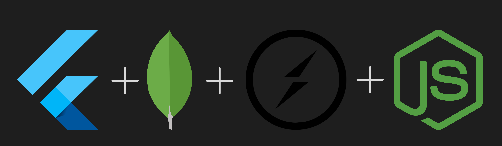

# Typeracer
<p align="center">
  <a href="https://firebase.google.com/docs/flutter">
    <br/>
  </a>
  <h1 align="center">Flutter + Express + Socket.io + MongoDB</h1>
</p>

A completely Responsive Typeracer App- Works only on Android & Web! 

## Features
- Responsive UI
- Real Time
- Create Rooms
- Join Rooms
- Calculate WPM
- Display LeaderBoards


## Installation
run the following commands to run your app:
```bash
  flutter pub get
  flutter run
```

For installing the libraries
```bash
  npm install
```

```bash
  npm run dev
```


## Tech Used
**Server**: MongoDB, Socket.io, ExpressJS, NodeJS, JavaScript

**Client**: Flutter, Provider
    
## Feedback
- If you have any feedback, please reach out to me at amit.singh.9312687983@gmail.com